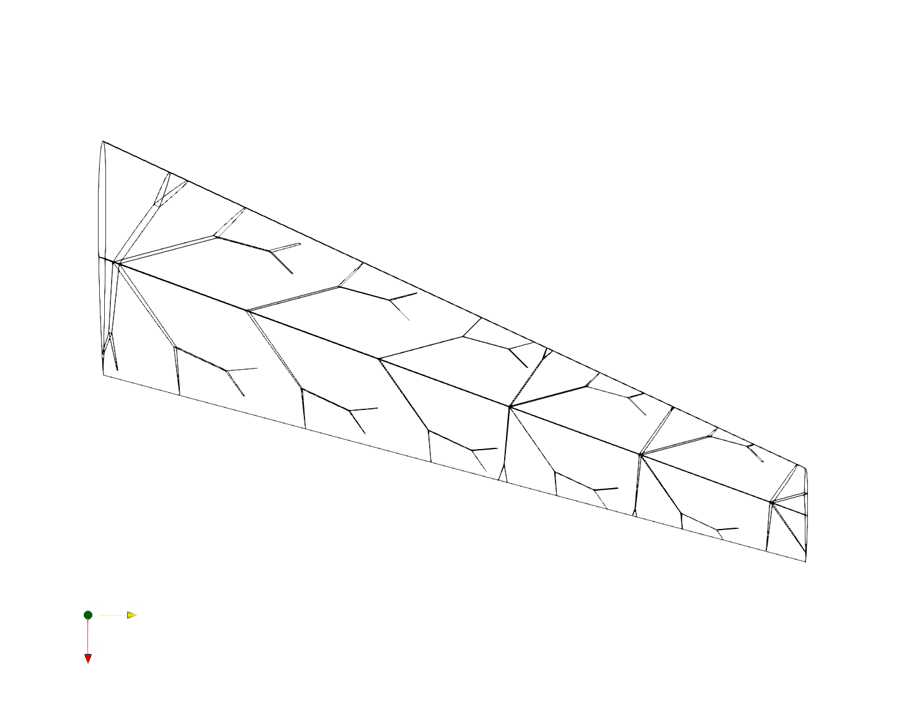
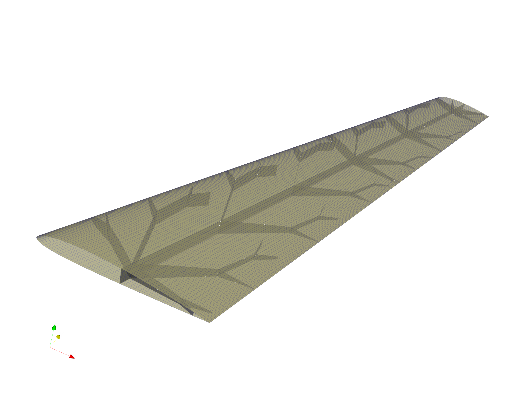
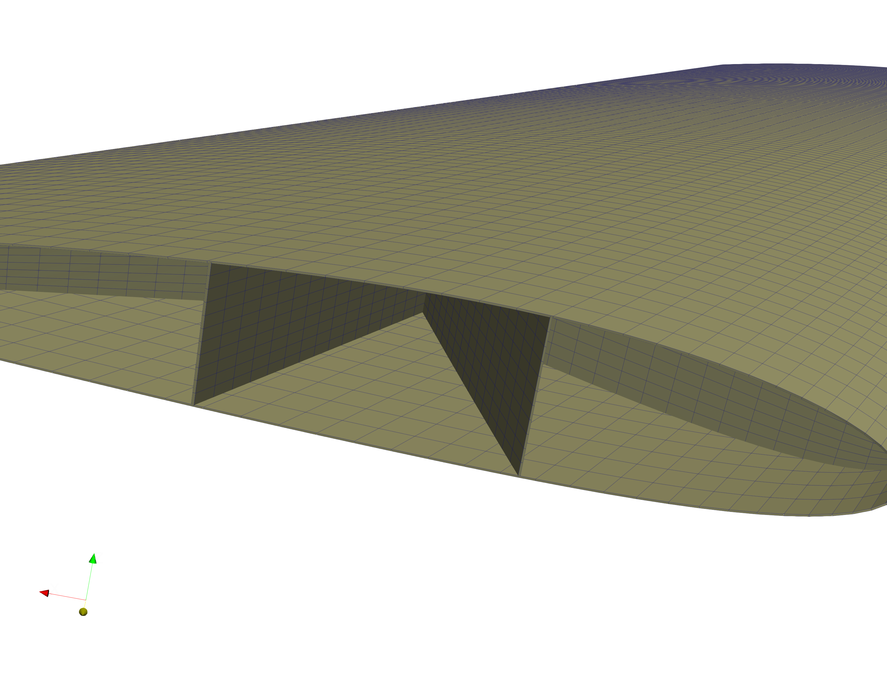
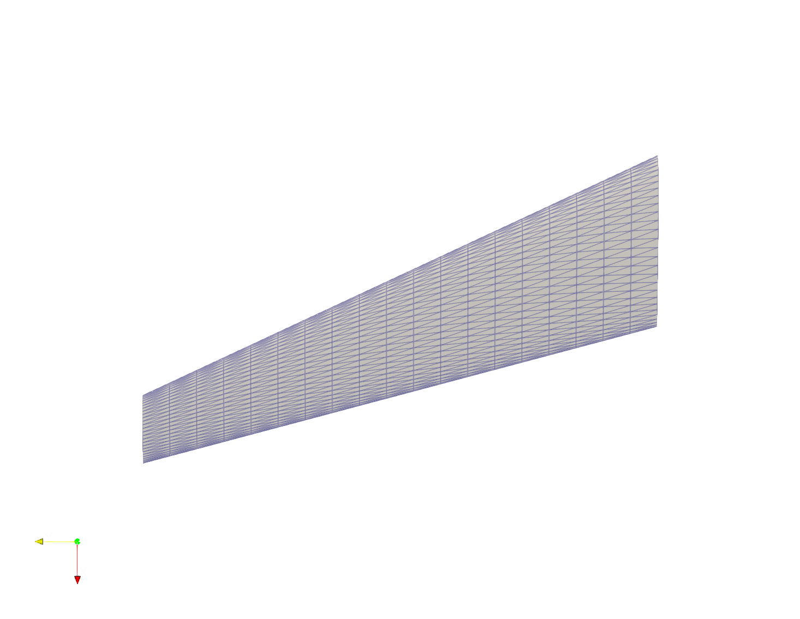
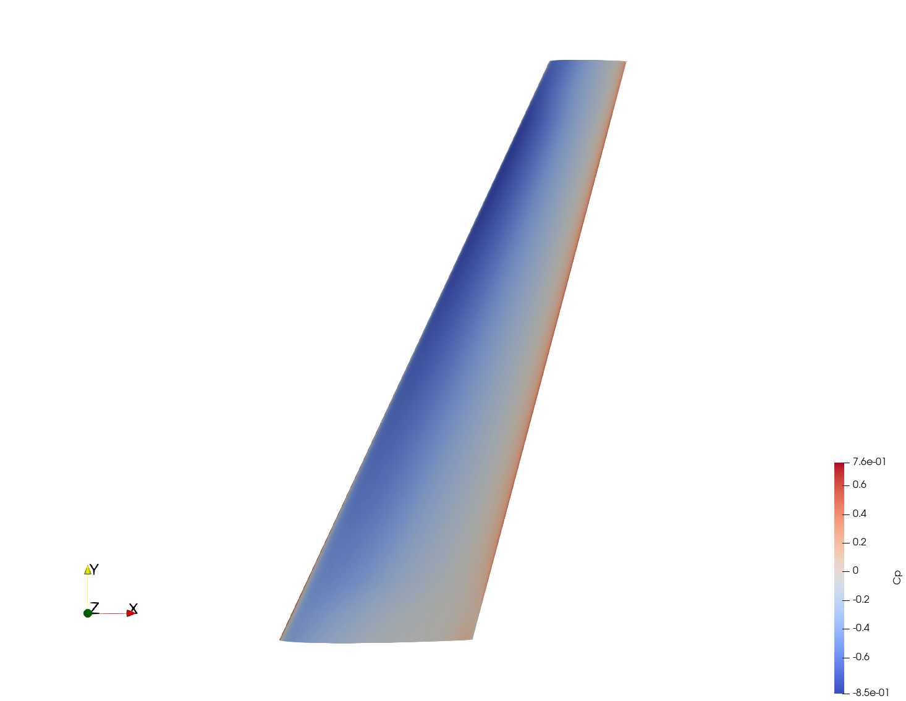
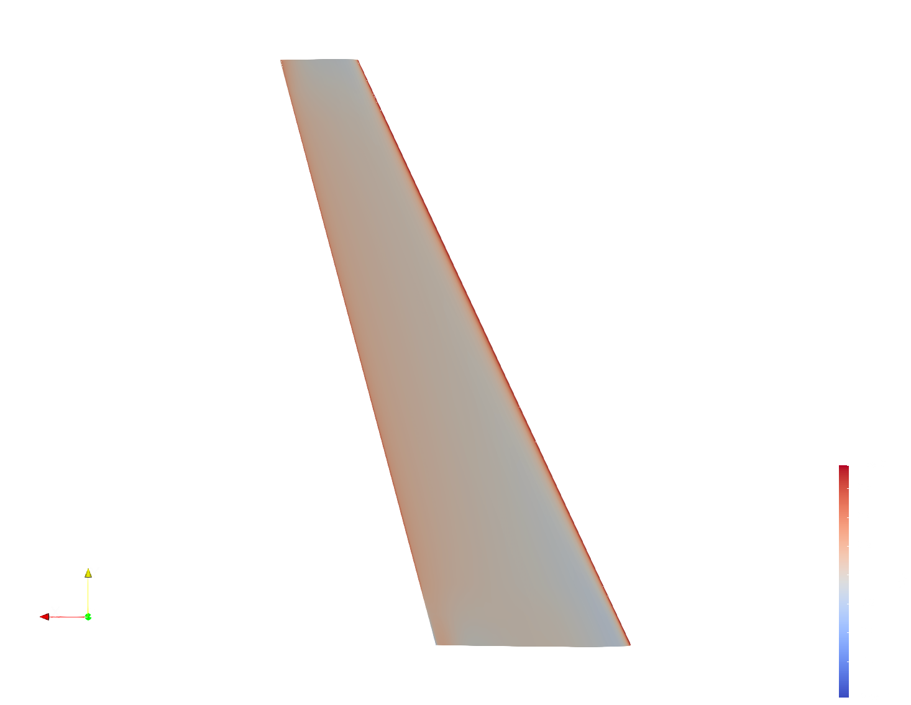
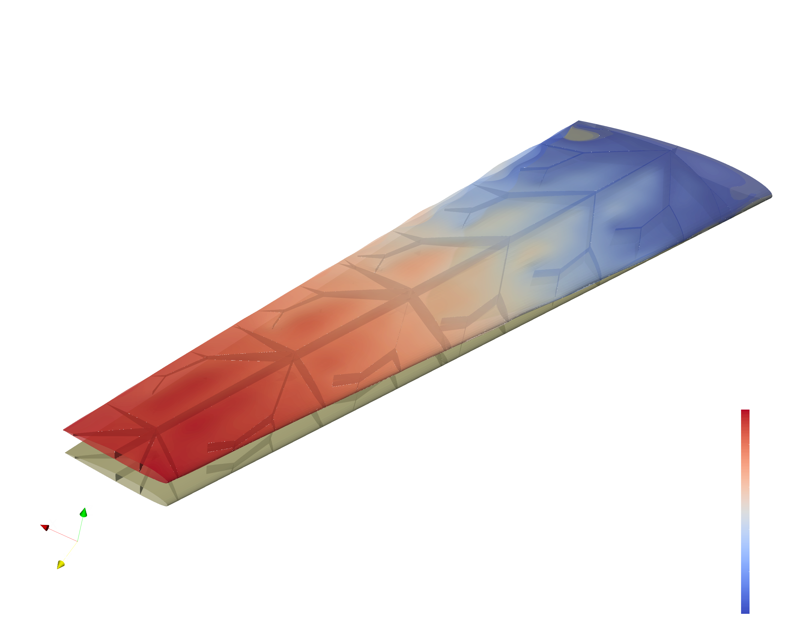

# Example 09: 3D Aero Loads & FEM Pipeline

This example demonstrates the advanced **3D aerodynamic and structural simulation pipeline**. It utilizes the `FLOWPanel.jl` 3D panel method solver to estimate pressure distributions over a volumetric B-spline wing, and transfers those loads onto a fully 3D structural mesh featuring hollow shells and internal fractal webs.

## 1. 3D B-Rep Geometry Generation

FROND translates the 1D fractal graph into fully 3D, interconnected CAD surfaces (B-Reps). A boolean intersection is performed to ensure the internal webs conform exactly to the wing's Outer Mold Line (OML). 

*Figure 1: Generated 3D Fractal Web Geometry inside the Wing OML.*

## 2. FEM Meshing (Gmsh)

The B-Rep geometry is exported to STEP files and meshed using `gmsh` to produce a high-fidelity 2D shell mesh (quadrilaterals and triangles) representing both the wing skin and the internal structural webs.

*Figure 2: Global 3D Shell Mesh for the Skin and Webs.*

*Figure 3: Detail view of the internal structured web meshing.*

## 3. 3D Panel Method Aerodynamics (FLOWPanel.jl)

Unlike the 2D VLM, this pipeline uses a true 3D panel method solver (`FLOWPanel.jl`). It generates an aerodynamic surface mesh independent of the structural mesh.

*Figure 4: The Aerodynamic Panel Mesh.*

It then calculates the continuous pressure distribution ($C_p$) over the upper and lower surfaces of the thick wing geometry at a given angle of attack ($\alpha$) and velocity ($V$).

*Figure 5: Pressure Coefficient ($C_p$) distribution on the upper surface.*

*Figure 6: Pressure Coefficient ($C_p$) distribution on the lower surface.*

## 4. Load Mapping & Web-to-Skin MPCs

Once the aerodynamic forces are calculated on the panel centroids, FROND maps them conservatively onto the structural skin mesh using Inverse Distance Weighting (IDW). It actively verifies physical force conservation by calculating the L2 norm discrepancy between total aerodynamic force and total mapped force.

Because the web mesh and skin mesh are generated independently, their nodes are non-conformal. FROND solves this by automatically detecting web boundaries and generating robust **Multi-Point Constraints (MPCs)**. For a web boundary node $w_i$, FROND finds the 3 closest skin nodes ($s_1, s_2, s_3$) and formulates a weighted linear constraint equation:

$$ \vec{u}_{w_i} = C_1 \vec{u}_{s_1} + C_2 \vec{u}_{s_2} + C_3 \vec{u}_{s_3} $$

This ties the internal structure rigidly to the external skin.

## 5. FEM Results (CalculiX)

CalculiX solves the static structural analysis using the assigned orthotropic material properties (e.g., CFRP_T300). The 3D model accurately captures complex torsion, bending, and localized stress concentrations at the fractal junctions. 

The post-processor converts the raw results into `.vtu` files for ParaView, where variables like displacement magnitude and aerodynamic load density can be visualized simultaneously.

*Figure 7: Final Structural Deformation / Displacement Magnitude.*
