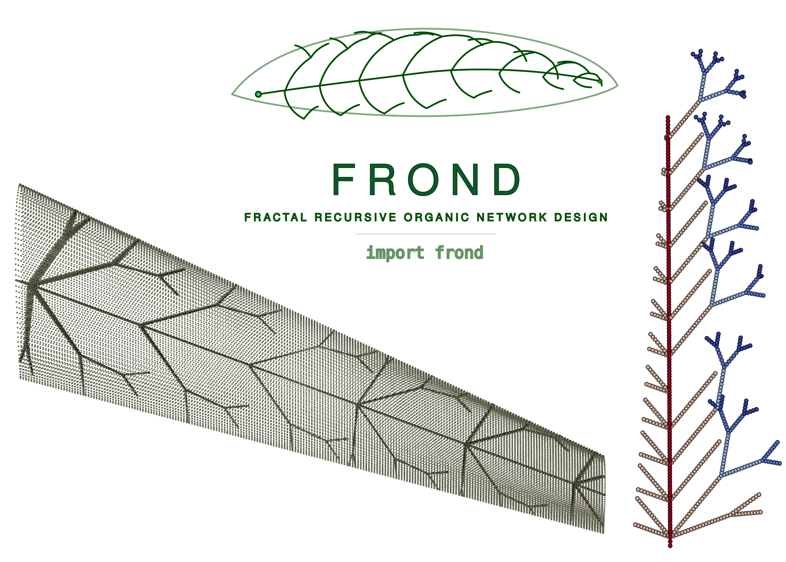

# Fractal Wing Generator (`fractal-wing`)

A professional, modularized Python package for the generation of fractal tree-like structures for aerodynamic wing design. The package provides high-level versatility for structural optimization by implementing non-uniform station distribution laws, per-depth branching mode switching, per-branch thickness control, multi-trunk support, and automated self-intersection avoidance.



## Features

- **Adaptive Branching Modes**: Support for per-recursion-depth mode switching (e.g., transition from *sympodial* to *monopodial* deeper in the tree).
- **Non-Uniform Station Distribution**: Provides geometric, cosine, power-law, bimodal, and custom spacing strategies.
- **Granular Branch Control**: Per-branch thickness control and tunable recursion termination thresholds.
- **Multi-Trunk Support**: Generate complex designs with multiple independent trunks while maintaining global crossing constraints.
- **AeroShape NURBS Integration**: Directly query $C^2$-continuous aerodynamic surfaces to restrict fractal growth perfectly within real CAD boundaries.
- **Fully Structured Hybrid Meshing**: Generates high-fidelity structured Quad (S4) shell meshes using Gmsh. Features independent, topologically locked wing skin meshing and perfectly conformal internal web fragment meshing.
- **CalculiX & ParaView Integration**: Fully automated FEM pipeline that builds simulation decks, establishes rigorous mathematically-exact **Node-to-Node MPCs** (Multi-Point Constraints) for contact without brittle tolerances, applies boundary conditions, solves the structural response, and converts results to `.vtu` format for ParaView visualization.
- **Integrated 3D Panel Aerodynamics**: Native coupling with `FLOWPanel.jl` (Julia) to run ultra-fast 3D panel method calculations over the wing's OML structured grid. Automatically maps distributed aerodynamic forces onto structural skin nodes using Inverse Distance Weighting (IDW) while mathematically conserving total force and moment resultant vectors.

## Installation

The package can be installed in editable mode using `pip`:

```bash
git clone <repository_url>
cd fractal_structures_wing
pip install -e .
pip install gmsh  # Required for FEM meshing
```

### Aerodynamic Solver Setup (Julia)
The aerodynamic features require a standard Julia installation. **No modifications are made to any external Julia libraries.** You can install the required official packages directly:

```bash
julia -e 'using Pkg; Pkg.add(["FLOWPanel", "VortexLattice", "WriteVTK", "JSON", "StaticArrays"])'
```
*(This will automatically download and install `FLOWPanel.jl`, `VortexLattice.jl`, and standard IO packages in your default global environment or your active project environment.)*

## Quick Start

```python
import canopy as fw
from aeroshape.geometry.wings import MultiSegmentWing

# 1. Provide an AeroShape MultiSegmentWing
aero_wing = MultiSegmentWing(...)

# 2. Wrap it with the Adapter
wing = fw.AeroWingAdapter(aero_wing)

# 3. Configure spanwise-zoned branching behavior
zones = [
    {
        'eta_start': 0.0, 'eta_end': 0.4,
        'diag_sub': fw.SubParams(mode='sympodial', max_depth=3),
        'chord_sub': fw.SubParams(mode='dichotomous', max_depth=2),
    },
    {
        'eta_start': 0.4, 'eta_end': 1.0,
        'diag_sub': fw.SubParams(mode='monopodial', max_depth=2),
        'chord_sub': fw.SubParams(mode='sympodial', max_depth=1),
    }
]

# 4. Create station distribution and generate segments
stations = fw.make_zoned_stations(n_stations=14, zones=zones, spacing='geometric')
spec = fw.TrunkSpec(chord_frac=0.5, stations=stations, allow_crossing=False)
gen = fw.TreeGenerator(wing)
segments = gen.generate(spec)

# 5. Export CAD B-Rep Shells to STEP
step_path = "fractal_mesh_shell.step"
assembly, props = fw.build_brep_webs(segments, aero_wing, as_solid=False, output_step=step_path)

# 6. Extract Structured FEM Mesh directly from STEP using Gmsh
# You can define independent element sizes for the skin and webs to reduce total element count
mesher = fw.GmshMesher(target_elem_size=0.025, skin_elem_size=0.05)
stats = mesher.mesh(step_path, "fractal_mesh.inp", skin_step=skin_step_path, web_properties=props)

# 7. Run 3D Panel Aerodynamic Analysis (FLOWPanel.jl)
aero_data = fw.run_aerodynamic_analysis(
    wing=aero_wing,
    aoa=4.0,
    magVinf=30.0,
    rho=1.225
)

# 8. Map aerodynamic panel forces onto structural skin nodes
nodes, skin_nodes = fw.parse_mesh_for_mapping("fractal_mesh.inp")
mapped_forces = fw.map_aerodynamic_loads(
    aero_centroids=aero_data["centroids"],
    aero_forces=aero_data["forces"],
    nodes_dict=nodes,
    skin_node_ids=skin_nodes
)

# 9. Build simulation deck with mapped aerodynamic loads & Run CalculiX
sim_path = fw.build_ccx_deck(
    mesh_inp="fractal_mesh.inp",
    web_properties=props,
    segments=segments,
    skin_thickness=0.003,
    mapped_aero_forces=mapped_forces
)

# 10. Run solver with automatic parallelism & convert results to VTU
result = fw.run_ccx(sim_path, convert_vtu=True)
print(f"Solver finished in {result['elapsed_s']:.1f}s")
```

## Performance Optimization

The FEM pipeline has been optimized to handle complex organic fractal meshes efficiently:
- **Parallel Assembly**: `run_ccx` automatically detects your CPU cores and sets `CCX_NPROC_STIFFNESS` and `OMP_NUM_THREADS` to parallelize stiffness matrix assembly and results calculation.
- **Fast I/O**: `build_ccx_deck` defaults to a mixed binary/ASCII `.frd` format (`*NODE OUTPUT`), reducing result file sizes by ~40% and accelerating disk I/O. Set `binary_output=False` when using `ccx2paraview`.
- **Fast Parsing**: The Python-based `.inp` parser is vectorized via NumPy, allowing million-line mesh files to be processed in seconds.
- **Multi-threaded Meshing**: `GmshMesher` configures the OpenCASCADE kernel and Frontal-Delaunay algorithms to utilize all available CPU threads.
- **Topological Robustness**: The CAD pipeline includes a dynamic Trailing Edge web retraction algorithm (`build_brep_webs`). If an internal branch converges to the mathematically sharp trailing edge of the wing (creating a degenerate 3-edged triangle), the web's tip is automatically pulled inward by 2% of its length. This ensures the FEM solver receives 100% 4-sided quadrilaterals while allowing nearest-neighbor multi-point constraints (`cKDTree`) to seamlessly transfer loads to the trailing edge skin.

## Examples

The `examples/` directory contains demonstration scripts covering core capabilities:
- `ex01_basic_modes.py`: Demonstrates the 4 main branching modes independently.
- `ex02_mixed_mode.py`: Shows combination of structural modes.
- `ex03_non_uniform_spacing.py`: Compares different distribution laws (uniform vs. non-uniform).
- `ex04_organic_structures.py`: Synthesizes deep tree-like structures with graded parameters.
- `ex05_crossing_control.py`: Demonstrates the self-intersection pruning logic (`allow_crossing`).
- `ex06_fem_export.py`: Extracts exact mathematical topology via OpenCASCADE and generates a Gmsh structured mesh for CalculiX, executing the full simulation pipeline.
- `ex07_aeroshape_integration.py`: Demonstrates CAD boolean operations with AeroShape NURBS models.
- `ex08_fem_organic.py`: End-to-end FEM simulation for a dense, spanwise-zoned organic fractal structure with multiple distributed point loads.
- `ex09_aero_loads.py`: Full end-to-end multi-disciplinary design and analysis (MDA) loop coupling planform generation, CAD STEP export, Gmsh meshing, FLOWPanel.jl 3D aerodynamic panel solve, IDW load transfer with resultant conservation checks, and clamped CalculiX structural static analysis solve.
- `ex10_aero_mesh_dependency.py`: Aerodynamic mesh dependency study showing grid convergence of Lift and Drag coefficients as the chordwise and spanwise panel densities are systematically refined.
- `ex11_2d_flapping_wing.py`: Full aero-structural analysis of a 2D wing with flapping kinematics using a custom VortexLattice.jl aerodynamic solver, 1D beam discretization for internal webs, and multi-point tie constraint FEM coupling.

## ParaView Visualization & Post-Processing

To overcome standard limitations with mixed-element meshes and wireframe rendering in ParaView, the solver automatically post-processes results into specialized formats:

### 1. Solid-Surface Aerodynamic Load Visualization (`_panels.vtu`)
Instead of displaying bound vortex filaments as colored wireframe edges (the default VortexLattice.jl behavior), the solver generates a dedicated `<vtk_prefix>_panels.vtu` mesh:
- Combines grid coordinates into solid 2D `VTK_QUAD` cells.
- Binds aerodynamic variables (`circulation`, `force_magnitude`, `force_x`, `force_y`, `force_z`) as **cell-centered data**.
- **ParaView Usage**: Open the file, change the **Representation** from *Outline* to **Surface**, and choose the desired color variable to view a smooth, continuous load distribution.

### 2. Isolated Beam and Skin Post-Processing (`_beams.vtp` and `_skin.vtu`)
Because CalculiX outputs a single mixed-type mesh, standard ParaView filters (like the **Tube** filter for beam members) are disabled. The solver automatically splits the output mesh file:
- **`*_beams.vtp`**: Isolates all 1D beam elements (`B31`/`B32`) as standard 1D lines in a true PolyData format, preserving simulation results (`U`, `S`, `S_Mises`). Crucially, it parses the actual physical beam radius from the `.inp` deck and stores it as a `TubeRadius` point-data array.
  - **ParaView Usage**: Load this file, select it, apply the **Tube** filter, set *Vary Radius* to **By Absolute Scalar**, and select **TubeRadius** to visualize the structure with its true, variable physical dimensions.
- **`*_skin.vtu`**: Isolates all 2D shell elements (`S3`/`S4`) and contains their 3D-extruded volumetric representations.

## License

This project is licensed under the MIT License - see the [LICENSE](LICENSE) file for details.
